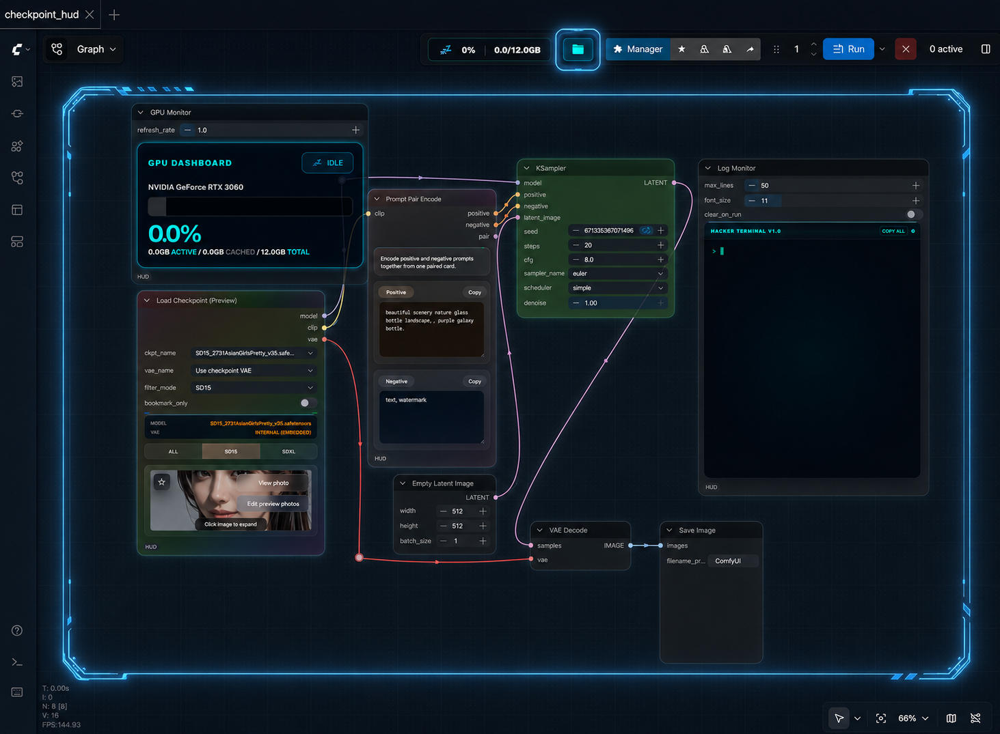

# ComfyUI-HUD

ComfyUI-HUD는 실제 워크플로우 사용감을 높이는 데 초점을 둔 커스텀 노드 팩입니다. 
로더 중심 HUD 노드, 텍스트 보조 도구, 모니터링 노드, 그리고 통합 에셋 브라우저를 함께 제공합니다.

영문 문서: [README.md](README.md)

ComfyUI를 더 집중해서 쓰고 싶다면 [wenovaX/ComfyUI-Nexus](https://github.com/wenovaX/ComfyUI-Nexus)도 추천합니다.

## 주요 기능

- `샘플 워크플로우`
  - 최초 실행 시 내장 예제를 `user/<profile>/workflows/hud_sample`로 복사하며 기존 파일은 덮어쓰지 않습니다
- `Asset Hub`
  - `input`, `output`, 체크포인트 프리뷰 폴더, 등록한 로컬 폴더를 한 곳에서 관리하는 플로팅 에셋 브라우저
  - 그리드 브라우저, 북마크, 이름 변경/삭제, 드래그 앤 드롭 업로드, 키보드 이동, 통합 미디어 뷰어 지원
- `Load Checkpoint (Preview)`
  - 인라인 프리뷰, 갤러리 보기, VAE 선택, 필터 탭, 북마크 필터, 체크포인트 프리뷰 폴더 편집 지원
- `Stylish Naming`
  - 프리셋, 서버 저장 상태, 다음 번호 계산 흐름을 가진 텍스트/경로 보조 노드
- `Batch Images (Mask Editor)`
  - 여러 이미지를 배치로 다루고 마스크를 직접 편집하는 노드
- `Prompt / Conditioning` 보조 노드
  - `String Combiner`, `String Encode Combiner`, `Prompt Pair Encode`, `Prompt Pair Relay`
- `모니터링 / 로더`
  - `GPU Monitor`, `Log Monitor`, `IPAdapter FaceID Loader`, `OpenPose ControlNet Master`

## 노드 목록

### Loaders

#### `Load Checkpoint (Preview)`

- 체크포인트 로더 + 인라인 프리뷰 + 갤러리
- 같은 흐름에서 VAE 선택 가능
- `All`, `SD15`, `SDXL` 필터와 북마크 전용 필터 지원
- 프리뷰 갤러리는 `models/checkpoints` 아래 체크포인트 이름 폴더를 기준으로 동작

#### `VAE Resolver`

- 체크포인트 내장 VAE와 외부 VAE 파일 사이를 전환
- `clip` 패스스루 지원

### Text / Conditioning

#### `String Combiner`

- 여러 섹션을 조합해 프롬프트 문자열을 만드는 노드

#### `String Encode Combiner`

- 텍스트 병합과 CLIP conditioning 인코딩을 한 번에 처리

#### `Prompt Pair Encode`

- positive / negative 프롬프트를 각각 인코딩

#### `Prompt Pair Relay`

- `positive`, `negative`, `pair` 를 중계하는 노드

#### `Stylish Naming`

- 텍스트 / 경로 출력 형식을 정리하는 유틸리티 노드
- 프리셋과 상태는 서버 측 데이터로 저장

### Image

#### `Batch Images (Mask Editor)`

- 동적 이미지 슬롯
- 내장 마스크 에디터
- 배치 `IMAGE`, `MASK` 출력

### Utility / Monitoring

#### `GPU Monitor`

- HUD 모니터링용 GPU 상태 노드

#### `Log Monitor`

- HUD 로그 확인용 노드

#### `IPAdapter FaceID Loader`

- IPAdapter + CLIP Vision + InsightFace 흐름 보조 로더

#### `OpenPose ControlNet Master`

- Prompt Pair 기반 워크플로우에서 ControlNet 적용을 돕는 노드

## Asset Hub

Asset Hub는 ComfyUI 어디서든 전역으로 열 수 있습니다.

- 토글 단축키: `Ctrl + Shift + B`
- 사용 가능한 흐름:
  - `input`, `output` 브라우징
  - 북마크한 로컬 폴더 열기
  - 체크포인트 프리뷰 폴더 편집
  - 통합 미디어 뷰어로 이미지/비디오 확인
- 지원 작업:
  - 복사, 잘라내기, 붙여넣기
  - 이름 변경, 삭제
  - 폴더 생성
  - 드래그 앤 드롭 또는 OS 파일 선택기로 업로드

## 구조 메모

최근 정리는 기능 동작은 유지하면서 유지보수성을 높이는 방향으로 진행되었습니다.

- 체크포인트 프리뷰 프론트엔드는 다음처럼 분리되어 있습니다.
  - `preview.js`
  - `preview_ui_factory.js`
  - `preview_gallery_utils.js`
  - `preview_data_controller.js`
  - `preview_checkpoint_filter_controller.js`
- Stylish Naming 내부 명칭은 `stylish_naming` 으로 통일했습니다.
  - 기존 `stylish_label` 상태 파일과 route 도 호환되도록 유지합니다.
- 파일 매니저 백엔드는 책임별로 분리되어 있습니다.
  - `file_manager_nodes.py`
  - `file_manager_bookmarks.py`
  - `file_manager_paths.py`
  - `file_manager_ops.py`

## 카테고리

- `HUD/Loaders`
- `HUD/Text`
- `HUD/Conditioning`
- `HUD/Image`
- `HUD/Monitoring`
- `HUD/IPAdapter`
- `HUD/ControlNet`

## 안정성 메모

- 모든 노드는 독립적인 커스텀 노드이며 ComfyUI 코어 노드를 직접 패치하지 않습니다.
- UI 비중이 큰 노드는 워크플로우 속성 또는 서버 측 HUD 데이터 파일에 상태를 저장합니다.
- 업데이트 후 UI가 이상하면 `Ctrl+F5` 후 ComfyUI 재시작을 권장합니다.
- 콘솔 로그는 `[ComfyUI_HUD]` 접두사를 사용합니다.
